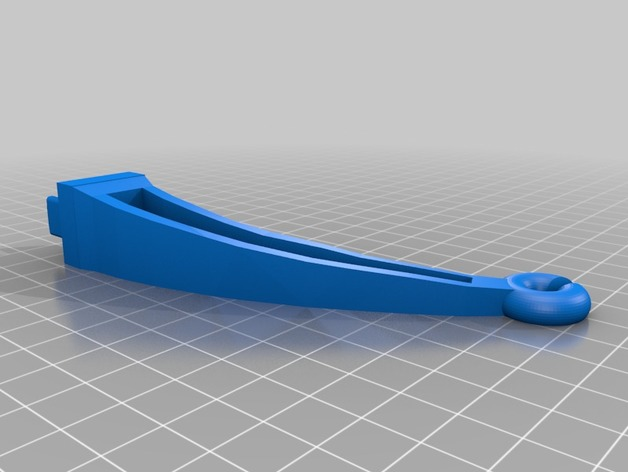

# Ender 3 Pro Filament Arm

Author: [historyhunters2](https://www.thingiverse.com/historyhunters2)

Sources: https://www.thingiverse.com/thing:3322008

## Print Settings

**Material:** PETG

**Supports:** Everywhere

**Layer Height:** 0.2

**Infill:** 40%

