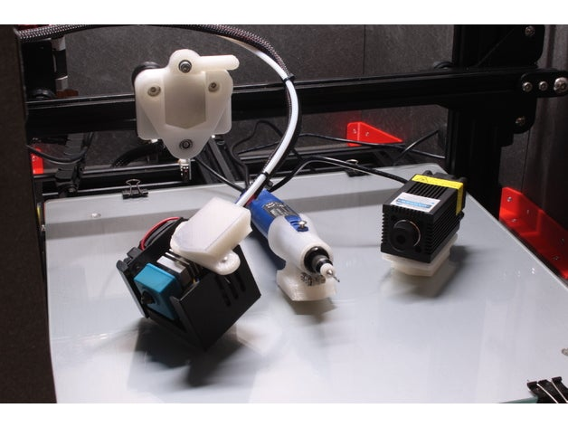

# Quicktool change probe mount (BL-Touch included)

Author: [achmed20](https://www.thingiverse.com/achmed20)

Sources: https://www.thingiverse.com/thing:3813267

Author: [ProperPrinting](https://www.thingiverse.com/ProperPrinting)

Sources: https://www.thingiverse.com/thing:3369444

## Print Settings

**Material:** PETG

**Supports:** Everywhere

**Layer Height:** 0.2

**Infill:** 50%

